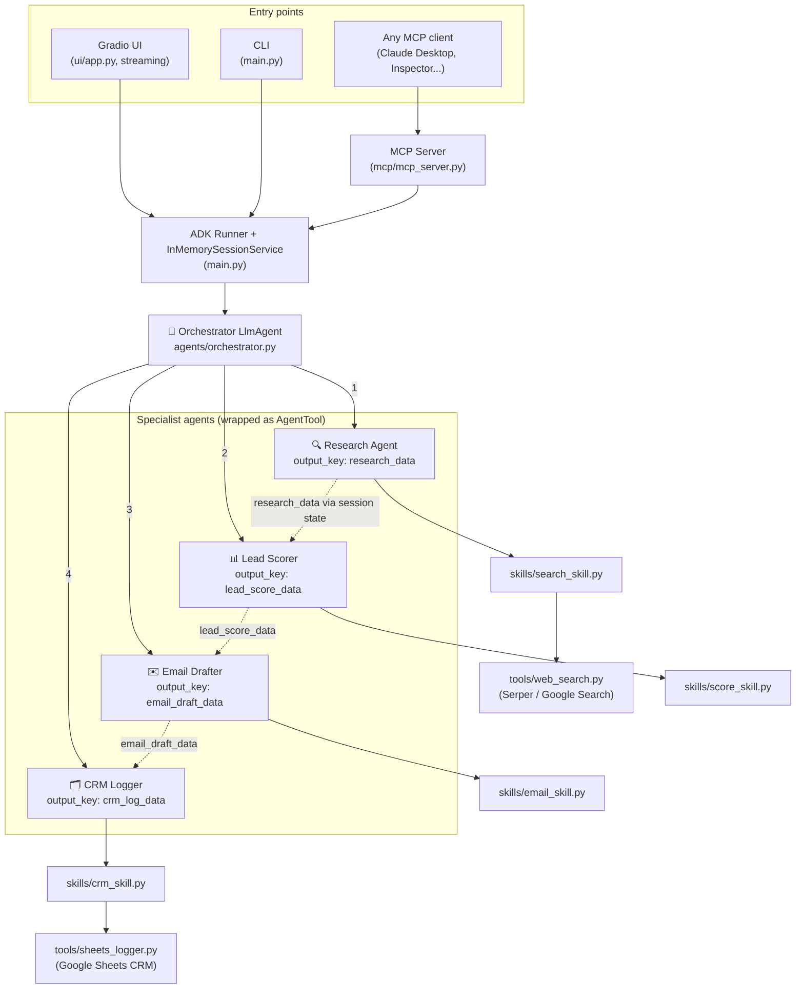

# 🤖 AI Sales Intelligence Agent

**A multi-agent B2B sales pipeline built on Google ADK: type a company name, get back structured research, a 1–100 lead score, a personalized cold email, and an automatic CRM entry — in about a minute.**

Built for the **Google Kaggle Capstone — Vibecoding Agents (Agents for Business track)**.


> 🎬 **Demo video:** [youtu.be/8DLDiZ7zeb0](https://youtu.be/8DLDiZ7zeb0) · 🚀 **Live demo:** [Hugging Face Space](https://huggingface.co/spaces/anshpandeyy9140/ai-sales-intelligence-agent)

---

## The problem

Sales development reps spend **hours per lead** manually researching companies, judging fit, and writing outreach that doesn't sound like a template. This agent compresses that entire workflow into one prompt: the company name.

## What it does

```
"Stripe"  ──▶  🔍 Research  ──▶  📊 Score 87/100 (A)  ──▶  ✉️ Personalized email  ──▶  🗂️ Logged to CRM
```

1. **Researches** the company live on the web (industry, funding, news, tech stack, pain points, growth signals)
2. **Scores** the lead 1–100 across four weighted criteria, with reasoning and risk factors
3. **Drafts** a human-sounding cold email whose tone adapts to the lead grade (A = bold, D = casual)
4. **Logs** everything to a Google Sheets CRM
5. **Remembers** companies already researched in the session (ADK session state memory)

---

## Competition capability matrix

| # | Requirement | Where | How |
|---|-------------|-------|-----|
| 1 | **Multi-agent system (ADK)** | `agents/` — CODE | 1 orchestrator + 4 specialist `LlmAgent`s wired via `AgentTool` |
| 2 | **MCP Server** | `mcp/mcp_server.py` — CODE | 5 tools exposed over the official MCP Python SDK (stdio) |
| 3 | **Antigravity** | VIDEO | Development & testing workflow shown in the demo video |
| 4 | **Security** | CODE + VIDEO | Input validation, sanitization, no hardcoded secrets, dual rate limiting, MCP tool allowlist ([details](#security)) |
| 5 | **Deployability** | VIDEO | Live Hugging Face Space ([deploy guide](docs/DEPLOYMENT.md)) |
| 6 | **Agent skills** | `skills/` — CODE | Reusable, typed ADK tool functions shared across agents |

---

## Architecture



### Why this design scores on architecture

- **Agent-as-a-Tool, not delegation.** Sub-agents are wrapped in `AgentTool`, so the orchestrator *stays in control* and explicitly invokes each specialist — instead of `sub_agents=[...]` delegation, where control transfers away permanently.
- **Zero manual JSON plumbing.** Each agent declares `output_key` (e.g. `research_data`); ADK writes its validated output into session state and forwards it to the next agent's `{research_data}` instruction placeholder automatically.
- **Structured outputs everywhere.** Every agent has a Pydantic `output_schema`, so downstream code never parses free-form LLM text.
- **LLM/deterministic division of labor.** LLMs estimate and write; plain Python tools do what LLMs are bad at — exact arithmetic and grade thresholds (`score_skill`), exact word counts (`email_skill`), API writes (`crm_skill`).
- **Callbacks.** `after_agent_callback` gives the orchestrator session memory of researched companies; a global `before_model_callback` throttle keeps all five agents inside one shared Gemini quota.

### The agents

| Agent | Role | Tools | Output (`output_key`) |
|-------|------|-------|-----------------------|
| `sales_intelligence_orchestrator` | Root — coordinates the 4-step pipeline | 4 × `AgentTool` | final user summary |
| `research_agent` | Live web research → structured intel | `research_company_web`, `search_web_query` | `research_data` |
| `lead_scorer_agent` | Scores lead 1–100, grade A–D | `calculate_lead_score` | `lead_score_data` |
| `email_drafter_agent` | Grade-adaptive personalized cold email | `package_email_draft` | `email_draft_data` |
| `crm_logger_agent` | Writes the record to Google Sheets | `log_to_crm` | `crm_log_data` |

---

## MCP Server

`mcp/mcp_server.py` exposes the agent system to **any** MCP-compatible client over stdio, using the official [MCP Python SDK](https://github.com/modelcontextprotocol/python-sdk):

| Tool | Description |
|------|-------------|
| `research_company` | Run the research agent for one company |
| `score_lead` | Score a lead from research data |
| `draft_email` | Draft the outreach email |
| `run_full_pipeline` | Full pipeline: research → score → email → CRM |
| `search_web` | Raw Google search (Serper) |

**Try it with the MCP Inspector:**

```bash
npx @modelcontextprotocol/inspector python mcp/mcp_server.py
```

**Use it from Claude Desktop** (`claude_desktop_config.json`):

```json
{
  "mcpServers": {
    "ai-sales-intelligence": {
      "command": "python",
      "args": ["C:/absolute/path/to/ai-sales-intelligence-agent/mcp/mcp_server.py"]
    }
  }
}
```

> ⚠️ Implementation note: the local `mcp/` folder intentionally has **no** `__init__.py` — adding one would shadow the installed `mcp` SDK package. Agent calls are dispatched with `asyncio.to_thread` because the sync agent wrappers each own their own event loop.

---

## Agent skills (`skills/`)

Reusable, typed tool functions following ADK conventions (type-hinted params, docstrings, JSON-serializable dict returns with a `status` key so agents can branch on failure without crashing the turn):

- `search_skill.py` — multi-query company research + custom follow-up search, with link dedup
- `score_skill.py` — deterministic score combination, clamping, grade thresholds
- `email_skill.py` — email packaging with exact word count + length-limit validation
- `crm_skill.py` — flat-argument CRM write (flat args because LLMs fill flat tool params far more reliably than nested JSON)

---

## Security

- **Input validation boundary** — every entry point (UI, CLI, MCP) funnels through `main._validate_company_name` (type, emptiness, length bounds); the MCP server re-validates all arguments
- **Query sanitization** — `tools/web_search.py` strips non-alphanumeric characters from search inputs and length-caps custom queries
- **No hardcoded secrets** — all keys live in `.env` (gitignored, with `.env.example` template); Sheets uses a service-account file that is also gitignored
- **Dual rate limiting** — a global `before_model_callback` throttle across *all* agents keeps Gemini under quota (`GEMINI_MAX_CALLS_PER_MINUTE`), plus an independent Serper request limiter
- **MCP hardening** — explicit tool allowlist, argument type checks, structured error results instead of raw tracebacks
- **XSS-safe UI** — all model/web-derived values are HTML-escaped before rendering in the Gradio score card

---

## Quickstart

```bash
git clone https://github.com/ansh0965/ai-sales-intelligence-agent.git
cd ai-sales-intelligence-agent
python -m venv .venv && .venv\Scripts\activate    # Windows (source .venv/bin/activate on macOS/Linux)
pip install -r requirements.txt
copy .env.example .env                             # then fill in your keys
```

You need two keys (plus one optional):

| Key | Where to get it | Required |
|-----|-----------------|----------|
| `GEMINI_API_KEY` | [aistudio.google.com/apikey](https://aistudio.google.com/apikey) | ✅ |
| `SERPER_API_KEY` | [serper.dev](https://serper.dev) (2,500 free searches) | ✅ |
| `GOOGLE_SHEETS_ID` + service account | Google Cloud Console | Optional — CRM logging skips gracefully |

**Quota tip:** create the Gemini key on a **billing-enabled** Cloud project to get Tier-1 limits (~1,000 req/min vs ~10 free), then set `GEMINI_MAX_CALLS_PER_MINUTE=30`. Vertex AI is also supported with zero code changes — see the commented block in `.env.example`.

### Run it

```bash
python ui/app.py            # Gradio UI with live agent-activity streaming → http://localhost:7860
python main.py              # CLI — runs the full pipeline for "Stripe", prints JSON
python mcp/mcp_server.py    # MCP server (stdio) for external AI clients
```

---

## Project structure

```
ai-sales-intelligence-agent/
├── main.py                  # Entry point: shared ADK Runner, session, input validation, streaming
├── agents/
│   ├── orchestrator.py      # Root LlmAgent — AgentTool wiring, session memory callback
│   ├── research_agent.py    # Web research → ResearchOutput schema
│   ├── lead_scorer.py       # Scoring → LeadScoreOutput schema
│   ├── email_drafter.py     # Copywriting → EmailDraftOutput schema
│   ├── crm_logger.py        # Sheets logging → CrmLogOutput schema
│   └── rate_limiter.py      # Global before_model_callback Gemini throttle
├── skills/                  # Reusable ADK tool functions (competition: "agent skills")
├── tools/                   # Low-level integrations: Serper search, Google Sheets
├── mcp/mcp_server.py        # MCP server exposing 5 tools (competition: "MCP")
├── ui/app.py                # Gradio 6 UI with live event streaming
└── docs/                    # Deployment guide, writeup, video script
```

## Tech stack

Google ADK 2.3.0 · Gemini 2.5 Flash · MCP Python SDK · Gradio 6 · Serper (Google Search) · gspread (Google Sheets) · Pydantic

## License

[MIT](LICENSE)
